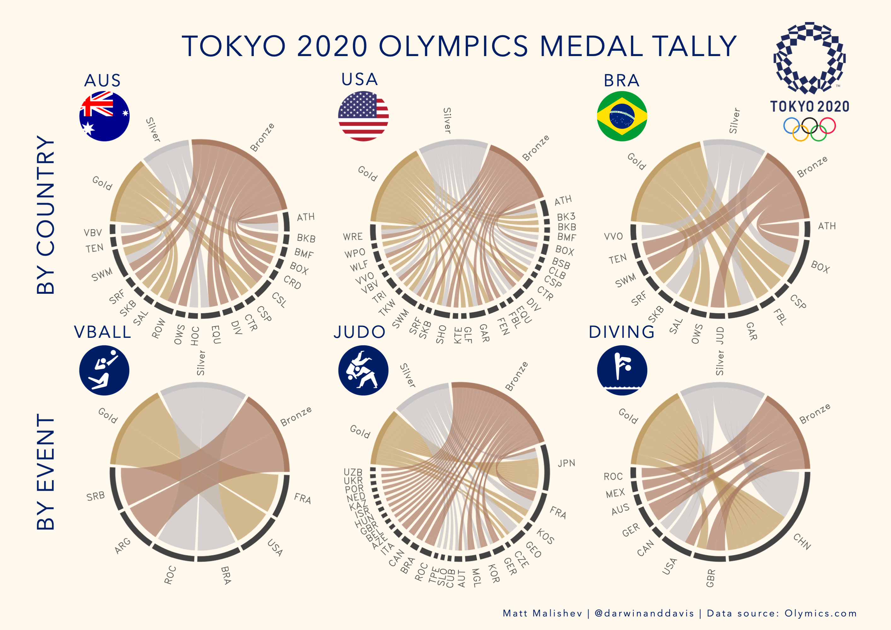

# Data viz projects v. 13 

### Matt Malishev  
### @darwinanddavis  

******      

## A trivia site for the Netflix series DARK    

<h3> 
  <a href="https://darwinanddavis.github.io/misc/dark/#/section">Netflix DARK trivia</a>
</h3>

  
    

    

******      

## Tokyo 2020 Olympics medal data  

Medal tally data for the Tokyo 2020 Olympics showing individual medal count by country and medal count per event. Data webscraped from the offical Olympics website. See the `r` folder for full medal tally data download.  

  

    
    

******      

  <h2 style="color:#FF7E7E">Digital footprint</h2>
  

    <!--   -->
     
     
  

