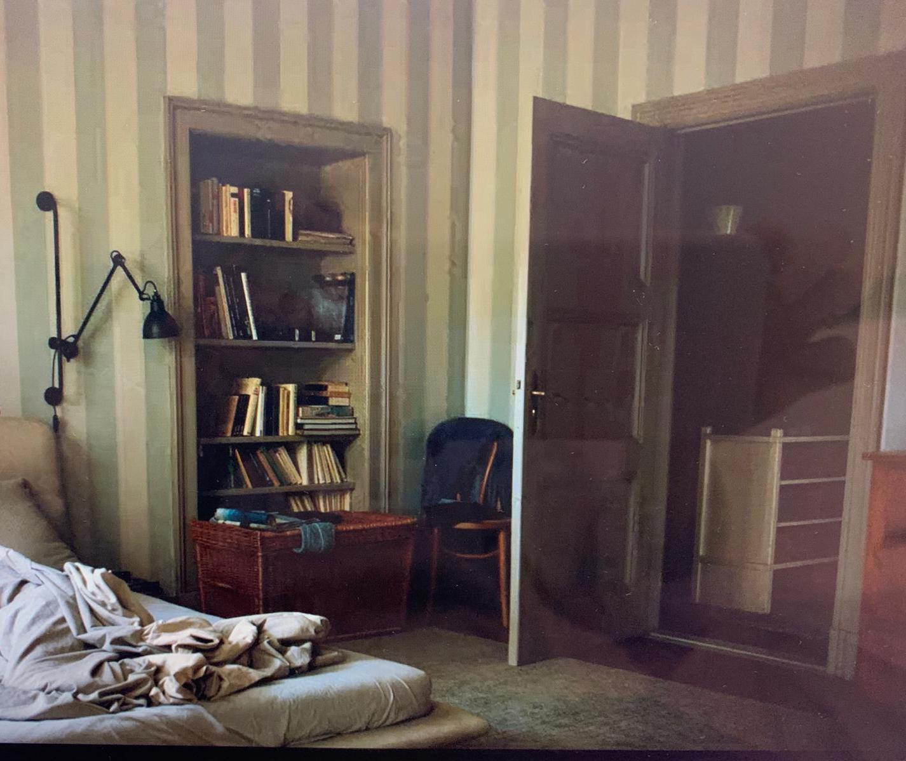
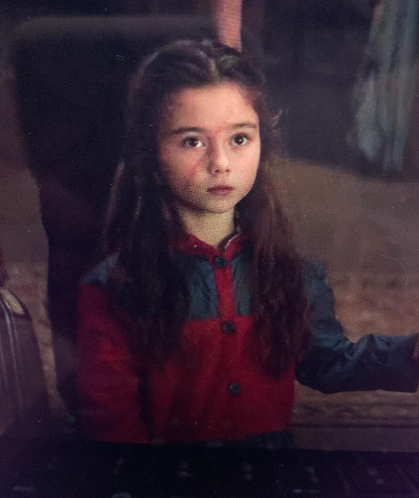
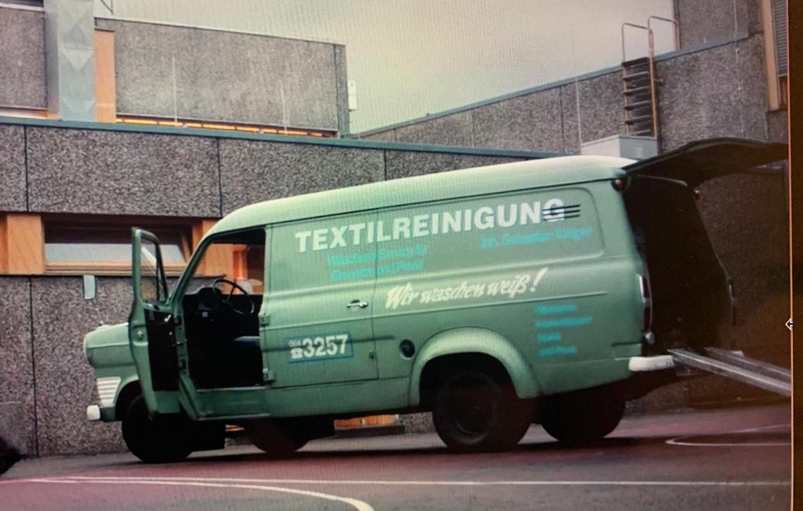

# {data-background="https://cdna.asoundeffect.com/wp-content/uploads/2018/01/04011935/netflix-dark-sound.jpg" data-background-size="99.99% 99.99% " data-background-repeat="no-repeat"}

<link href="https://fonts.googleapis.com/css2?family=Nixie+One&display=swap" rel="stylesheet">
<link href="https://fonts.googleapis.com/css2?family=Noto+Sans+HK:wght@100&display=swap" rel="stylesheet">
<link rel="stylesheet" href="https://maxcdn.bootstrapcdn.com/font-awesome/4.5.0/css/font-awesome.min.css">

DARK EXAM

---   

  <h4>SPOILER ALERT</h4>
  <h2>Contains spoilers for all three seasons of DARK</h2>

  

---  

Press `f` for fullscreen     
Press `b` for blackboard to write your answers   
`DELETE` will clear current slide     

# {data-background="https://hips.hearstapps.com/hmg-prod.s3.amazonaws.com/images/dark-1556312644.png?crop=0.934xw:0.907xh;0.0381xw,0.0931xh&resize=900:*" data-background-size="99.99% 99.99% " data-background-repeat="no-repeat"}

<!-- 
READY?
 -->

    <h2> Did  you  study? </h2>

---  

<h1>Warm up</h1>
  

In season 2, episode 4, there are two pictures hanging on the left wall of Aleksander’s office at the nuclear power plant. 
   
Write the chemical formula for the black radioactive material Cesium 137 Jonas first uses to time travel.  

# 1

What is Jonas’ dad's name?  
(1 point)       

# 2

Who is Charlotte’s husband?   
(1 point)      
 
# 3

How do you spell police in German?  
(1 point)       

# 4

What is the surname of the redhead boy that goes missing in 2019?    
(1 point)  
 
A. Obendorf  
B. Burgendorf  
C. Odendorf  
D. Torbendorf

# 5

Which famous person does Mikkel idolise?  
(1 point)    

# 6

What does Regina Tiedermann do for a living?  
(1 point)    

# 7

Where was the old blind man in the carriage going?  
(2 points)    

# 8  

What is the significance of November 4, 2019?   
(3 points)            

# 9

After Katharina time travels, who tells her where to find Ulrich?     
(1 point)      
 
A. Jonas    
B. Hannah    
C. Egon    

# 10

Who does young Noah kill in front of the cave?    
(2 points)      

# 11

What time does Mikkel go missing?   
(2 points)
   
A. 10:13  
B. 10:14  
C. 10:15  

# 12

What does _Sic Mundus Creatus Est_ mean?    
(2 points)     

# 13

What is on Helge's pendant?    
(1 point)  
  
Bonus point: What does it represent?    
(1 point)    

# 14  

Who is this character? (5 points)       

# 15  

Who are Hannah’s children?  
(3 points)    

# 16

Which characters appear in all three worlds?  
(3 points)      

# 17

How does Ulrich identify Mads at the morgue?  
(1 point)      

# 18

Draw the _Sic Mundus Creatus Est_ symbol.    
(1 point)      

Use the chalkboard option on the bottom left of the screen.    

# 19

How many pages does Claudia rip out of the _Sic Mundus_ book in the bunker at the end of season 3?   
(3 points)      

# 20  

What is Silja’s surname?   
(3 points)    

A. Tiedermann  
B. Kahnwald  
C. Kruger  

# 21

In season 2 after Ulrich breaks out of the psychiatric hospital and reconnects with Mikkel, what's the first thing they do?   
(2 points)    

# 22

What time does Katharina tell Ulrich to meet her to escape?  
(2 points)    

# 23 

What is Bernd Doppler's relation to Helge Doppler?      
(2 points)      

# 24  

What is Hannah's job?    
(1 point)    

# 25  

What does 80's Ulrich have written on the back of his jacket?   
(2 points)    

# 26  

Whose room is this? (5 points)      

# 27

What direction do the stairs go in Katharina's house in World 2?   
(1 point)        

# 28  

When someone time travels, what type of animals are found dead?  
(2 points)    

# 29  

Who is Agnes' dad?  
(2 points)    

# 30  

Who is the first person Jonas encounters when he first time travels?  
(1 point)    

A. Hannah Kruger  
B. Egon Tiedermann  
C. Charlotte Doppler  

# 31  

Who is this character? (4 points)             

  
# 32  

What colour is Hannah's dress at Ulrich and Katharina’s house party?  
(2 points)    

# 33  

List the people Martha and Jonas’ son kills.     
(3 points)    

# 34  

What is the name of the book that H.G. Tannhaus writes?  
(2 points)    

# 35  

Middle-aged Jonas receives a letter from second world Martha. What does he do with it?  
(2 points)        

# 36  

Who is Aleksander Kohler's brother?  
(3 points)        

# 37  

What does Franziska hide in the metal tin she stores under the train tracks?  
(2 points)    

# 38

What is H.G. Tannhaus’ son’s name?        
(1 point)  

A. Marrion  
B. Markell  
C. Marek  

# 39  

What sentence does Adam say to Jonas to reveal that they are the same person (in German)?  
(3 points)        

# 40  

Where does Katharina's name come from?  
(2 points)    

# 41  

Name all the characters who work in the police force.  
(3 points)    

# 42  

What colour is the plastic bag that Hannah uses to store Aleks' gun?  
(3 points)      

# 43   

What piece of evidence does Charlotte confiscate from the police station after Mikkel’s disappearance?  
(3 points)      
  
# 44  

Whose car is this? (5 points)      

# 45  

What is Claudia’s dog's name?  
(3 points)    

<!-- ________________________________________________________ slide break -->

---  

## Congratulations  

<!-- --- -->

<!-- 
You scored
 -->
<!--   -->
<!--   -->
<!--   -->
<!-- 
 -->
<!-- 
50
 -->

---  

  
Press `d` to download your written answers  

  

---  

## Created by 
## Matt Malishev  & Nicole Malishev      

 
@darwinanddavis

  

<!-- end body -->  
<!-- ____________________________________________________________________________ -->
